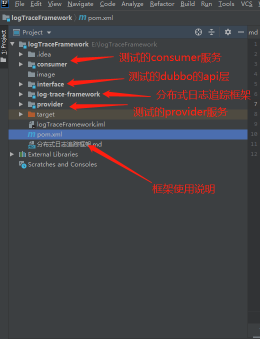
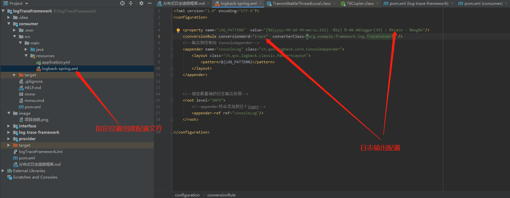

[toc]

#框架作用

##需求前景
在定位bug的日志链路时，我们希望能够根据某一个报错位置的日志，快速筛选出报错请求的所有日志记录。这就要求我们为每个
请求生成一个唯一id，并且在这个请求链路上的日志体现。

##涉及知识点

（1）ThreadLocal----用来存储请求链路中的唯一id的，生命周期与请求线程一致

（2）servlet提供的Filter----拦截请求，为请求生成唯一id

（3）dubbo提供的自定义参数传递----实现在RPC框架中携带自定义参数

（4）阿里ttl----实现在线程池中传递上下文

（5）logback输出日志格式----实现自定义日志格式

#项目架构




#快速接入

适用于spring+dubbo的分布式架构（如果要实现其他RPC框架的日志追踪，可以参考dubbo自己实现）

##（1）导入依赖

先将框架install到本地或者远程仓库，作者没有推到maven仓库，可以自己推

```
        <dependency>
            <groupId>org.example</groupId>
            <artifactId>log-trace-framework</artifactId>
            <version>1.0-SNAPSHOT</version>
        </dependency>
```

##（2）自定义日志格式





# 一些不足点

（1）有些中间件会导致链路断了。----解决方法，中间件转发时带上traceId即可（例如mq，里面有个mq的context可以附带自定义参数）


（2）可以考虑接入elk可视化日志。参考博客https://blog.csdn.net/sinat_27245917/article/details/108123826


